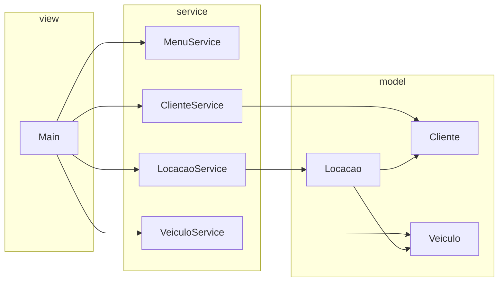

# Documentação técnica — Locadora FIAP

## 1. Objetivo do sistema

Informatizar de forma educacional o fluxo de uma locadora: **cadastrar veículos**, **cadastrar clientes** e **registrar locações**. O programa roda no **console**, sem persistência em banco ou arquivo.

---

## 2. Visão geral da arquitetura

O código segue uma separação simples em três camadas lógicas:

- **Modelo (`model`)**: objetos de domínio com atributos, construtores, encapsulamento e métodos de apresentação textual.
- **Serviço (`service`)**: operações que envolvem listas, busca e regras que não pertencem naturalmente a uma única entidade.
- **Visão (`view`)**: `Main` orquestra entrada/saída (`Scanner`, `System.out`), instancia serviços e mantém as coleções em memória.



---

## 3. Classes do modelo

### 3.1 `Cliente`

Representa o locatário.

| Atributo | Tipo | Descrição |
|----------|------|-----------|
| `nome` | `String` | Nome completo |
| `cpf` | `String` | Identificador usado nas validações de locação |
| `idade` | `int` | Idade |
| `cnh` | `String` | Número da CNH |

Método relevante: `exibirInformacaoCliente()` — texto formatado para o console.

### 3.2 `Veiculo`

Representa um veículo da frota.

| Atributo | Tipo | Descrição |
|----------|------|-----------|
| `modelo` | `String` | Modelo (chave de busca na locação) |
| `placa` | `String` | Placa |
| `ano` | `int` | Ano |
| `cor` | `String` | Cor |
| `fabricante` | `String` | Fabricante |
| `disponivel` | `boolean` | Indica se o veículo pode ser locado (`true` ao criar) |

Método relevante: `exibirInformacaoVeiculo()` — inclui situação “Disponível” / “Indisponível”.

### 3.3 `Locacao`

Associa um `Cliente` a um `Veiculo` em um intervalo de datas.

| Atributo | Tipo | Descrição |
|----------|------|-----------|
| `cliente` | `Cliente` | Quem locou |
| `veiculo` | `Veiculo` | Veículo locado |
| `dataInicio` | `LocalDate` | Início |
| `dataFim` | `LocalDate` | Devolução prevista |

Método relevante: `imprimirLocacao()` — período em `dd/MM/yyyy` e blocos indentados de cliente e veículo.

**Encapsulamento:** todas as entidades usam campos `private` com getters e setters públicos, alinhado ao exercício de POO da FIAP.

---

## 4. Camada de serviço

### 4.1 `MenuService`

`mostrarMenu()` retorna o texto estático das opções exibidas ao usuário.

### 4.2 `ClienteService`

- `mostrarUsuariosCadastrados(List)` — concatena as saídas de `exibirInformacaoCliente()` de cada cliente.
- `buscarUsuarioParaLocacao(List, nome)` — busca **case-insensitive** por nome; retorna `null` se não encontrar.

### 4.3 `VeiculoService`

- `veiculoParaLocacao(List)` — lista todos os veículos formatados.
- `veiculoDisponivel(List, modelo)` — primeiro veículo cujo modelo coincide (case-insensitive); pode retornar `null`.

### 4.4 `LocacaoService`

- `verificarSeClienteJaLocou(List<Locacao>, Cliente)` — percorre as locações registradas; se existir entrada com o **mesmo CPF** (`equalsIgnoreCase`), retorna **`false`** (cliente já figura em uma locação na lista). Caso contrário retorna **`true`** (pode registrar nova locação segundo essa regra).

> **Nome do método:** semanticamente soa como “já locou?”, mas o retorno **`true`** significa “pode prosseguir / não há locação com esse CPF na lista”. O `Main` usa esse contrato explicitamente.

---

## 5. Fluxo principal (`Main`)

1. Inicializa `Scanner`, `DateTimeFormatter` **`dd/MM/yyyy`**, serviços e três `ArrayList`: clientes, veículos, locações.
2. Loop até opção **10** (sair).
3. **Locação (3):** busca cliente por nome, veículo por modelo; se o veículo está `disponivel` e `verificarSeClienteJaLocou` retorna verdadeiro, lê datas, cria `Locacao`, marca veículo indisponível e adiciona à lista.

### 5.1 Formatação de datas

- **Entrada:** `LocalDate.parse(texto, formatter)` no `Main` com padrão **`MM`** para mês.
- **Saída em `Locacao`:** `DateTimeFormatter` com o mesmo padrão `dd/MM/yyyy` sobre `LocalDate`.  
  Não use `mm` minúsculo no padrão para mês: em `DateTimeFormatter`, `mm` é **minuto**, o que provoca `UnsupportedTemporalTypeException` com `LocalDate`.

---

## 6. Regras de negócio implementadas

| Regra | Implementação |
|-------|----------------|
| Veículo só locado se disponível | `Veiculo.isDisponivel()` e `setDisponivel(false)` ao fechar locação |
| Evitar nova locação para cliente já presente na lista | `LocacaoService.verificarSeClienteJaLocou` por CPF |
| Um veículo por vez | Flag `disponivel` no veículo |

### Limitações conhecidas (melhorias futuras)

- **Devolução:** não há fluxo que volte `disponivel` para `true` nem remova/marque locação como encerrada; com a regra atual, um cliente com CPF já listado em `locacaoList` **não** consegue nova locação na mesma execução.
- **Robustez:** buscas que retornam `null` podem causar `NullPointerException` se o nome ou modelo não existir; validação de entrada pode ser acrescentada.
- **Persistência:** apenas memória; sem JDBC, arquivo ou API.

---

## 7. Geração de JavaDoc (opcional)

Na raiz do projeto, com fontes em `src`:

```powershell
javadoc -d javadoc -encoding UTF-8 -charset UTF-8 -subpackages br.com.fiap.locadora -sourcepath src
```

Abra `javadoc/index.html` no navegador.

---

## 8. Referência de arquivos

| Arquivo | Função |
|---------|--------|
| `src/.../view/Main.java` | `main`, menu e listas |
| `src/.../model/*.java` | Entidades |
| `src/.../service/*.java` | Serviços |
| `README.md` | Guia rápido de uso e compilação |
